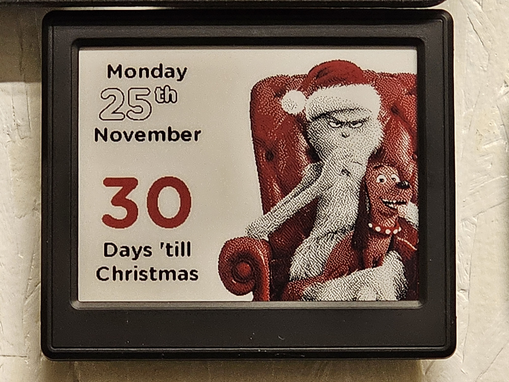

# OpenEPaperLink-HA-Christmas-Countdown
Count down the days till Christmas Day! All images are pulled down from an external server at https://www.chunkymedia.co.uk - to keep you surprised, don't look!! **FYI - These images are safe for family/kids/work etc - not that kind of surprise!!**  

The 4.2" version is more art based and will show the current data, days untill Christmas, and a full width Christmas themes background.

The date of Christmas is set in the variable `days_until_xmas` and shouldn't need altering year on year. 
The text used is 'Days 'til Christmas', 'Day 'til Christmas', and 'Merry Christmas'. Days of the week and months (4.2" version) can be found in the 
variables section - adjust according to your local language. 

**Edit automation in YAML.**

Home Assistant and a working [OpenEpaper](https://openepaperlink.de/) setup, with HA Integration - https://github.com/jonasniesner/open_epaper_link_homeassistant

## Sensors/Integrations needed:

* https://github.com/jonasniesner/open_epaper_link_homeassistant (Install via HACS)

## Installation
* Add font `GothamRnd-Bold.ttf` to `/config/media` Home Assistant (create the folder "media" too).
* Add contents of `automation-2.9-xmas-countdown.yaml` (2.9") or `automation-4.2-xmas-countdown.yaml` (4.2") to a new automation in Home Assistant (Choose "Edit in Yaml" from top right three dots in a new automation). The automation is using a time template of 00:01:00 time - adjust according to taste!

## Customizing
### Date
The date of Christmas is set in the variable `days_until_xmas` and shouldn't need altering year on year. If you celebrate Christmas on 24th (Christmas Eve) then 
adjust the calculation in the variable section where `day=25` and set to `day=24`, found twice.

If you don't use e.g. 1st, 2nd, 3rd, 4th date style (4.2" version) - add a `visible: false` for that text, around line 56, to hide it, and adjust your x positioning of the date number to suit.

### Text
The text used is 'Days 'til Christmas', 'Day 'til Christmas', and 'Merry Christmas' - adjust according to your local language.

Days of the week and months (4.2" version) can be found in the variables section - adjust according to your local language. 

In English we can use the word  till or 'til to mean until. If you do not have similar in your language: 'til = until. "till" is more commonly used in casual writing, while "until" is more appropriate for formal writing. 

**Usage of the work 'till - Bryan Garner, in his Modern American Usage, refers to it as “abominable,” which is rather polite when compared to Harper’s Dictionary of Contemporary Usage, which says “the formation ’till is a bastard word and is substandard.”** - haha
