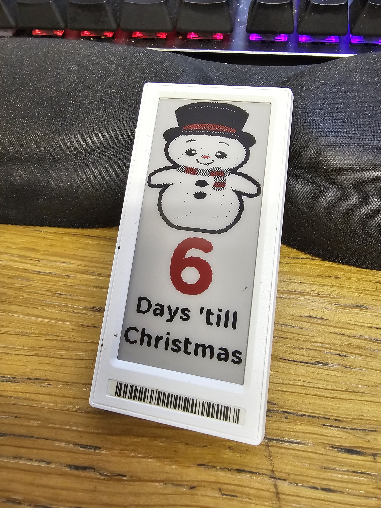

# OpenEPaperLink-HA-Christmas-Countdown
Count down the days till Christmas Day! All images are pulled down from an external server at https://www.chunkymedia.co.uk - keep you surprised! 

Set the date of Christmas in the automation variable `days_until_xmas`. 
The text used is 'Days 'till Christmas', 'Day 'till Christmas', and 'Merry Christmas' - adjust according to your local language. Edit automation in YAML.

Home Assistant and a working [OpenEpaper](https://openepaperlink.de/) setup, with HA Integration - https://github.com/jonasniesner/open_epaper_link_homeassistant

## Sensors/Integrations needed:

* https://github.com/jonasniesner/open_epaper_link_homeassistant (Install via HACS)
